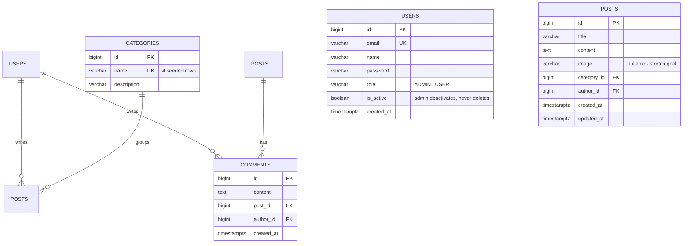

# Backend Schema — operational tables

**Owner:** Patrick Ndaziramiye (Backend)
**Schema:** `public`
**Migration:** `backend/apps/core/migrations/`

These four tables are the application's source of truth. Everything the API
reads or writes lives here. Nothing else writes to them.



## Delete behaviour

| Foreign key | On delete | Reason |
| --- | --- | --- |
| `POSTS.author_id` → USERS | RESTRICT | contributor stats depend on these rows |
| `COMMENTS.author_id` → USERS | RESTRICT | same |
| `COMMENTS.post_id` → POSTS | CASCADE | an orphaned comment thread is meaningless |
| `POSTS.category_id` → CATEGORIES | RESTRICT | the four categories are fixed |

Admin "delete user" sets `is_active = false`. No user row is ever removed.

## Indexes

```sql
CREATE INDEX idx_posts_cat_created ON posts (category_id, created_at DESC);
CREATE INDEX idx_posts_author      ON posts (author_id);
CREATE INDEX idx_comments_post     ON comments (post_id, created_at);
CREATE INDEX idx_comments_created  ON comments (created_at DESC);
```

All four exist for the analytics layer as much as for the API. Do not drop
them without telling the Data Engineer.

## Category naming

The written spec lists NEWS / EVENT / DISCUSSION / ALERT. The Figma shows
Events / Lost & Found / Recommendations / Help Requests. `CATEGORIES` is a
table rather than an enum, so settling this is an `UPDATE` on four rows —
no migration, no reseed, no frontend change.

## Contract

Column names and types here are a contract with the analytics layer
(see `schema-analytics.md`). Renaming a column or changing a timestamp type
breaks the three analytics views. Flag it in the team channel before you
migrate.
